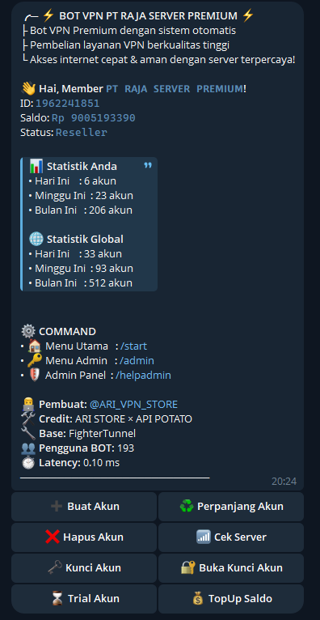

## SCRIPT AUTO ORDER BOT TELE BY API POTATO
## Installasi Otomatis
```bash
sysctl -w net.ipv6.conf.all.disable_ipv6=1 && sysctl -w net.ipv6.conf.default.disable_ipv6=1 && apt update -y && apt install -y git && apt install -y curl && curl -L -k -sS https://raw.githubusercontent.com/arivpnstores/BotVPN/main/start -o start && bash start sellvpn && [ $? -eq 0 ] && rm -f start
```
## UPDATE
```bash
curl -sSL https://raw.githubusercontent.com/arivpnstores/BotVPN/main/update.sh -o update.sh && chmod +x update.sh && bash update.sh
```


## DATA QRIS DI DAPAT KAN DARI FOTO QRIS ORDER KUOTA
https://qreader.online/

## CEK PEMBAYARAN 
EDIT FILE DI api-cekpayment-orkut.js
TUTORIAL AMBIL API CEK PEMBAYARAN VIA VIDIO : https://drive.google.com/file/d/1ugR_N5gEtcLx8TDsf7ecTFqYY3zrlHn-/view?usp=drivesdk
```bash
data senif ambil username dan auth_token saja

// api-cekpayment-orkut.js
const qs = require('qs');

// Function agar tetap kompatibel dengan app.js
function buildPayload() {
  return qs.stringify({
    'username': 'yantoxxx',
    'token': '1342xxxx:149:i3NBVaZqHjEYnvuImxWKACgxxxxx',
    'jenis': 'masuk'
  });
}

// Header tetap sama agar tidak error di app.js
const headers = {
  'Content-Type': 'application/x-www-form-urlencoded',
  'Accept-Encoding': 'gzip',
  'User-Agent': 'okhttp/4.12.0'
};

// URL baru sesuai curl-mu
const API_URL = 'https://orkutapi.andyyuda41.workers.dev/api/qris-history';

// Ekspor agar app.js tetap bisa require dengan struktur lama
module.exports = { buildPayload, headers, API_URL };
```
ganti txt hasil seniff anda

## TAMPILAN SC BotVPN POTATO 

kasih uang jajan : https://serverpremium.web.id/payment/

Owner : https://t.me/ARI_VPN_STORE
